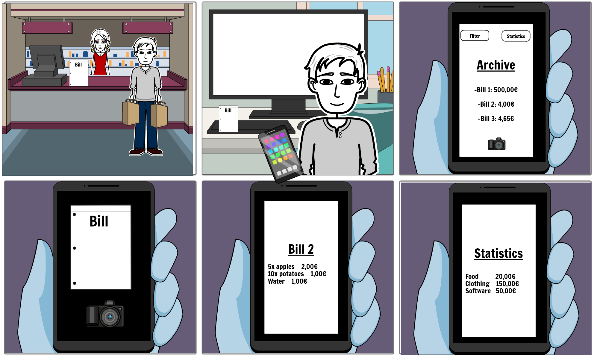

# 	:receipt: :euro:	 __EasyBill__ 	 :euro:	 :receipt:

## EasyBill is the free and open-source app for managing all your bills.

EasyBill helps you digitize, catalog and filter your bills and thus is the next step towards a more digitized world. It uses optical character recognition to translate images of your bills into a digital format. This helps you to have a better overview on your spendings.

## Story Board

We created our storyboard in StoryboardThat.

## Prototype

We designed our prototype in Figma, which provides a full working demo in an emulator.

__[Click me for the demo!](https://www.figma.com/file/U0r2xmu9Fyja9gI72Z8CTx/EasyBill)__

### Screenshots of our Prototype

## Sprint 1 - Overview

### Issues 

* Access detailed bill through archive ([#3][i3]) 
* Delete bill ([#4][i4]) 
* Set up database for bills ([#8][i8]) 
* Design suitable app icon ([#9][i9]) 
* Create views according to figma design ([#11][i11]) 
* Establish view navigation ([#12][i12]) 
* Create the initial project structure ([#14][i14]) 
* Create project structure ([#15][i15]) 
* Development pipeline ([#16][i16]) 
* Create archive from database ([#17][i17]) 

[i8]: https://github.com/mobileappdevhm20/team-project-team_6/issues/8
[i12]: https://github.com/mobileappdevhm20/team-project-team_6/issues/12
[i16]: https://github.com/mobileappdevhm20/team-project-team_6/issues/16
[i14]: https://github.com/mobileappdevhm20/team-project-team_6/issues/14
[i9]: https://github.com/mobileappdevhm20/team-project-team_6/issues/9
[i11]: https://github.com/mobileappdevhm20/team-project-team_6/issues/11
[i15]: https://github.com/mobileappdevhm20/team-project-team_6/issues/15
[i4]: https://github.com/mobileappdevhm20/team-project-team_6/issues/4
[i3]: https://github.com/mobileappdevhm20/team-project-team_6/issues/3
[i17]: https://github.com/mobileappdevhm20/team-project-team_6/issues/17

### Important pull requests

* feature/database -> develop ([#18][p18]) 
* development pipeline -> develop ([#19][p19]) 
* feature/design -> develop ([#22][p22]) 
* database refactoring -> develop ([#25][p25]) 
* feature/navigation -> develop ([#26][p26]) 
* experimental/viewmodel -> develop ([#31][p31])

[p18]: https://github.com/mobileappdevhm20/team-project-team_6/issues/18
[p22]: https://github.com/mobileappdevhm20/team-project-team_6/issues/22
[p26]: https://github.com/mobileappdevhm20/team-project-team_6/issues/26
[p25]: https://github.com/mobileappdevhm20/team-project-team_6/issues/25
[p19]: https://github.com/mobileappdevhm20/team-project-team_6/issues/19
[p31]: https://github.com/mobileappdevhm20/team-project-team_6/issues/31
